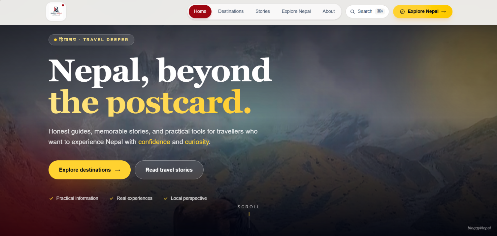
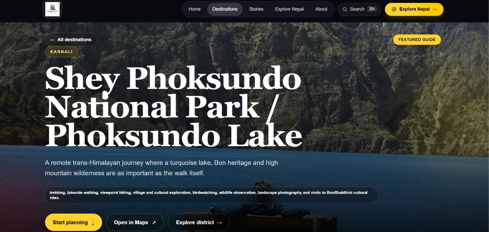
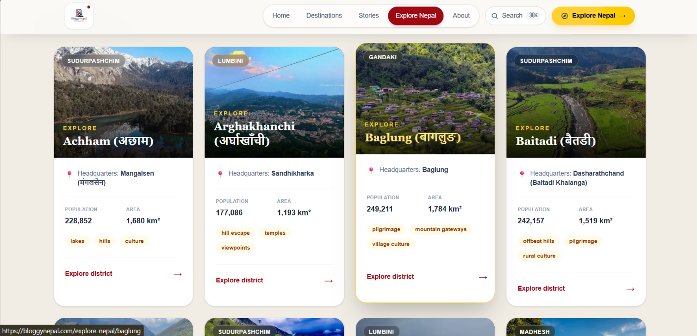

# BloggyNepal

**Nepal, beyond the postcard.**

BloggyNepal is a travel publishing and discovery project I’m building to make reliable, structured information about Nepal easier to find in one place. It brings destinations, districts, stories and practical planning information together in a fast, searchable web experience.

**Live site:** [bloggynepal.com](https://bloggynepal.com)


## What BloggyNepal does

- Publishes detailed destination guides with routes, activities, costs, maps, itineraries and practical planning information.
- Organizes Nepal by province and district so travellers can discover places beyond the most familiar tourism routes.
- Connects destinations, districts and travel stories through internal links and structured content.
- Uses Sanity CMS for editorial publishing and Supabase/PostgreSQL for community and application data.
- Includes search, comments, reactions, newsletter subscriptions and admin tools.
- Treats SEO, accessibility and content accuracy as part of the product rather than an afterthought.

<p align="center">
  

</p>

## Built with

| Area | Tools |
| --- | --- |
| Application | Next.js, React, TypeScript |
| Styling | Tailwind CSS |
| Content | Sanity CMS |
| Data & community features | Supabase, PostgreSQL |
| Maps | Leaflet |
| Email | Resend |
| Deployment & analytics | Vercel, Vercel Analytics |
| Development | Git, GitHub, ESLint |

## How it is put together

Next.js handles the public application, routing and server-side functionality. Sanity stores the editorial content such as destinations, districts, provinces and stories. Supabase provides the relational data used by features such as comments, reactions and subscribers. The production site is deployed on Vercel.

The repository also contains scripts for importing, auditing and updating structured tourism content. I use those scripts to catch content problems before making changes to production data.

```text
Visitor
   │
   ▼
Next.js application
   ├── Sanity CMS ─────── destinations, districts, provinces, stories
   ├── Supabase ───────── comments, reactions, subscribers, application data
   ├── API routes ─────── engagement and site functionality
   └── Vercel ─────────── deployment and analytics
```

## What I learned building it

BloggyNepal started as a way to build something useful around a subject I care about. It has grown into the project where I have learned the most about taking a web application beyond a tutorial.

Some of the areas I have worked through include:

- structuring a growing Next.js and TypeScript codebase;
- modelling connected content in Sanity;
- integrating a CMS with relational data and API routes;
- building reusable destination, district and province pages;
- handling metadata, canonical URLs, structured data and internal linking;
- writing import and audit scripts for larger content sets;
- debugging production issues instead of only working locally;
- using branches and pull requests to keep changes reviewable.

There is still a lot I want to improve. That is part of why I keep this project active: each feature gives me another real problem to understand and solve.

## Repository structure

```text
bloggyNepal/
├── public/              # Static assets
├── sanity/              # Sanity Studio and content schemas
├── scripts/             # Import, audit and content-maintenance scripts
├── src/
│   ├── app/             # Next.js routes and API routes
│   ├── components/      # Reusable UI components
│   └── lib/             # Queries, helpers and integrations
├── package.json
└── README.md
```

## Running locally

Requirements: a recent Node.js version and npm.

```bash
git clone https://github.com/Prayash17/bloggyNepal.git
cd bloggyNepal
npm install
npm run dev
```

Create a `.env.local` file with the required Sanity, Supabase and other service credentials before using features that depend on those services.

For a production build:

```bash
npm run build
npm start
```

## Roadmap

BloggyNepal is still being actively developed. The next areas I want to strengthen are:

- [ ] authentication and saved destinations/trips;
- [ ] better search and filtering;
- [ ] automated tests for important user flows;
- [ ] continued performance and accessibility improvements;
- [ ] practical itinerary and trip-planning tools.

## About me

I’m **Prayash Bhandari**, a BSc CSIT graduate from Nepal. I’m building BloggyNepal as a long-term product while improving my software development skills through real content, real users and real production constraints.

I’m currently especially interested in web development, Python, data and backend fundamentals.

If you are reviewing this repository for a role, BloggyNepal is the project that best represents how I learn, work through problems and keep improving something over time.
